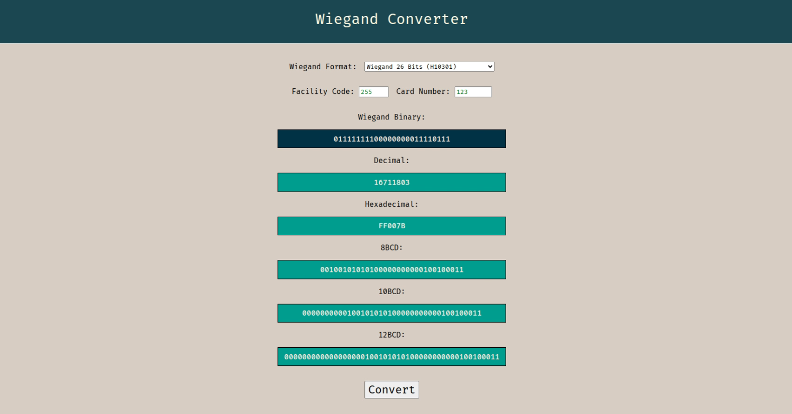

# Wiegand Converter

A simple utility to convert between Wiegand card formats and multiple numeric representations.

This tool allows you to input a **Facility Code** and **Card Number**, choose a Wiegand format, and obtain:

- Wiegand Binary
- Decimal value
- Hexadecimal value
- 8‑digit BCD
- 10‑digit BCD
- 12‑digit BCD

---

## 🖼️ Preview



---

## ✨ Features

- Supports multiple Wiegand formats:
  - Wiegand 26 Bits (H10301)
  - Wiegand 34 Bits (H10306)
  - Wiegand 35 Bits (Corporate 1000)
  - Wiegand 37 Bits (H10302)
  - Wiegand 37 Bits (H10304)
- Converts Facility Code + Card Number into full Wiegand data
- Displays results in several commonly used representations

---

## 📥 Inputs

| Field | Description |
|--------|------------|
| Wiegand Format | Select the target Wiegand specification |
| Facility Code | Site or system identifier |
| Card Number | Individual card ID |

---

## 📤 Outputs

After clicking **Convert**, the tool generates:

### Wiegand Binary
Raw Wiegand bit sequence including parity bits.

### Decimal
Full card value represented as a base‑10 integer.

### Hexadecimal
Full card value in hexadecimal notation.

### BCD Formats
Binary‑Coded Decimal representations padded to:

- 8 digits (8BCD)
- 10 digits (10BCD)
- 12 digits (12BCD)

---

## 🧠 What Is Wiegand?

Wiegand is a widely used protocol for transmitting card credential data in access control systems.

A Wiegand message typically consists of:

```
Parity Bit + Facility Code + Card Number + Parity Bit
```

Different formats allocate different bit lengths to each field.

---

## 🛠️ Use Cases

- Access control system configuration
- Card data validation
- Integration testing
- Hardware debugging
- Security system development

---

## 📷 Example

Input:

```
Facility Code: 255
Card Number: 123
Format: Wiegand 26 Bits (H10301)
```

Output includes:

- Binary representation
- Decimal value
- Hexadecimal value
- BCD formats

---

## 📄 License

Specify your license here.
